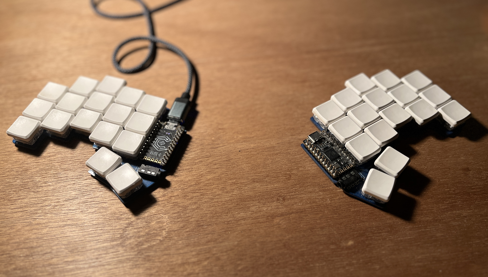

# Sylvan Franklin

Front end: Svelte, Solid, React, Vue etc. 
Normal: Java, Python, Lua, etc. 
Hot: Rust.  
Math: Julia, Tex, Haskell.

---

I use a 34 key [Ferris Sweep](https://github.com/pierrechevalier83/ferris), custom cropped for a sharper edges.  

---

Neovim and Alacritty, Colemak and Sweep. I move quickly, and always FOSS!

