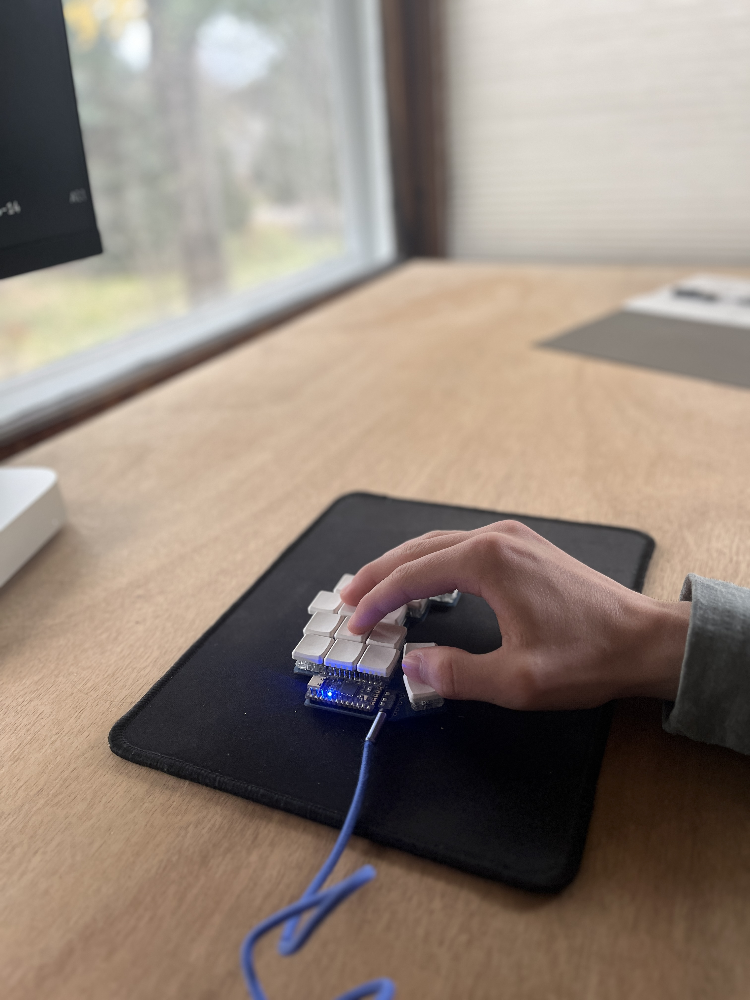

# Sylvan Franklin

I'm an applied Math student at the UVM, feelin the JS fatigue

---

## My Faves

- Front end: Svelte, Solid, Tailwind, Framer, React, Vue etc. 
- Back end: Java, Python, Lua, Typescript, etc. 
- Hot: Rust.  
- Math: Julia, Tex, Haskell.

---

I use a 34 key [Ferris Sweep](https://github.com/pierrechevalier83/ferris), custom cropped for a sharper edges.  

## Work Flow

Neovim, Alacritty, Colemak, and Sweep. Move FAST and FOSS. 

